<!-- Banner -->
<p align="center">
  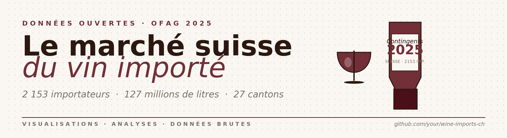
</p>

<p align="center">
  
  
  
  
  
  <a href="LICENSE"></a>
</p>

---

## 📌 Aperçu

Visualisation et exploration des **contingents d'importation de vin** en Suisse pour 2025, à partir des données ouvertes de l'**Office fédéral de l'agriculture (OFAG)**. Le dataset couvre **2 153 importateurs**, **127 millions de litres** et **27 cantons**, complété par une série historique 2012-2026 issue de l'**Administration fédérale des douanes (OFDF)**.

Le repo livre :

- 🐍 Un pipeline Python reproductible (`src/`) — un seul `make all` et tout se régénère
- 🖼️ **11 visualisations statiques** au format PNG haute définition + SVG vectoriel
- 🔍 **1 explorateur HTML interactif** (recherche, filtres canton, tri, CSV export, mode sombre)
- 📊 **1 dashboard D3 interactif** (vues liées : carte + barres + scatter + historique)
- 📑 Un **export xlsx multi-feuilles** (`data/processed/wine_imports_analysis.xlsx`) prêt pour Excel

## 🍷 Trois choses à retenir

> **Le marché est extraordinairement inégalitaire.** Sur 2 153 importateurs actifs, les **deux premiers** (Coop et Denner) représentent à eux seuls **43 %** du volume. Le coefficient de Gini atteint **0,96**. En revanche l'indice HHI (1 034) reste en zone « modérée » au sens antitrust — le marché a beaucoup d'acteurs minuscules mais pas de monopole dominant unique.

> **Le volume baisse, le prix monte.** Depuis 2012, le volume total importé a chuté de **−18 %** (190 → 155 Mkg), tandis que le prix moyen a progressé de **+22 %**. Le **rouge** porte cette baisse (−25 % en volume, +21 % en prix), le **blanc** garde un volume stable et un prix moins volatil.

> **La longue traîne est massive.** 42 % des importateurs déclarent moins de 1 000 litres — l'équivalent de 1 333 bouteilles. Caves familiales, distributeurs ethniques, négociants spécialisés.

## 🖼️ Galerie complète (11 graphiques)

### Vue d'ensemble et concentration

| | |
|---|---|
| [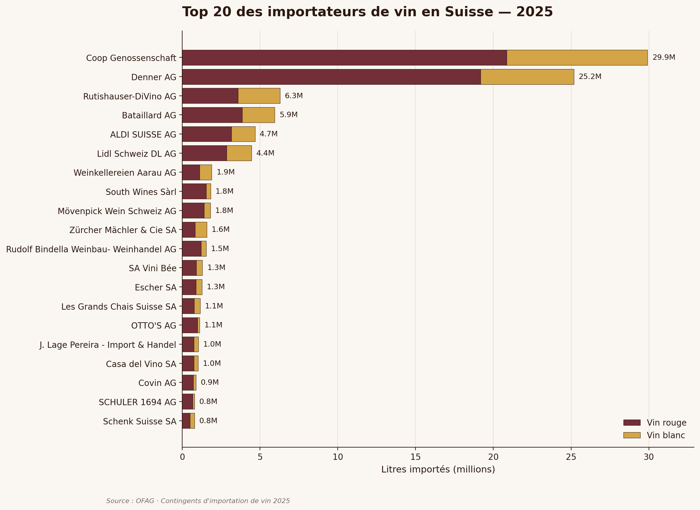](assets/charts/01_top20.png)<br>**Top 20 des importateurs** | [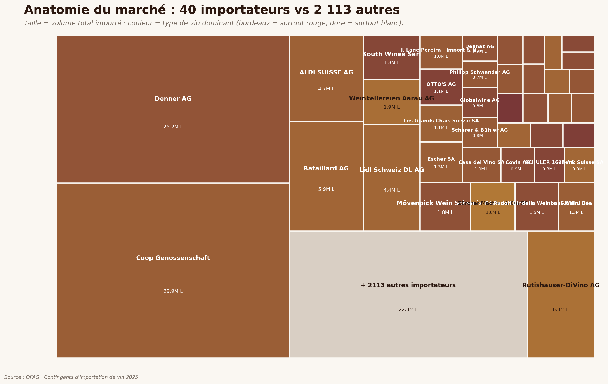](assets/charts/05_treemap.png)<br>**Treemap** : 40 importateurs vs « les 2 113 autres » |
| [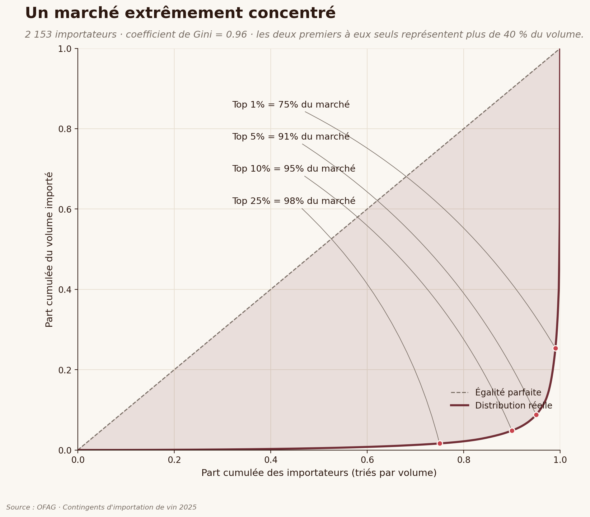](assets/charts/02_lorenz.png)<br>**Lorenz / Gini = 0,96** | [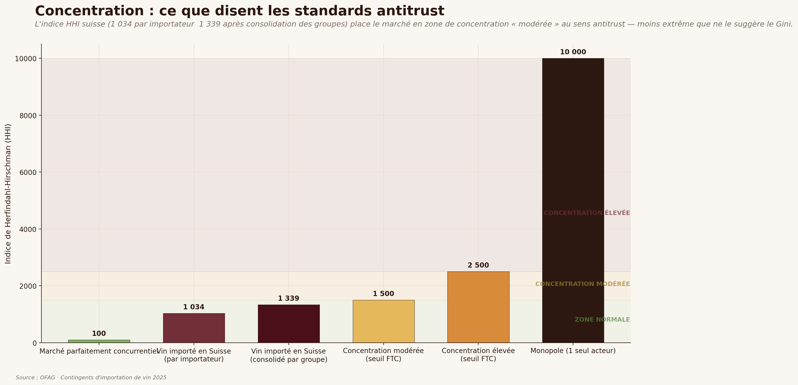](assets/charts/10_hhi.png)<br>**HHI** : ce que disent les standards antitrust |
| [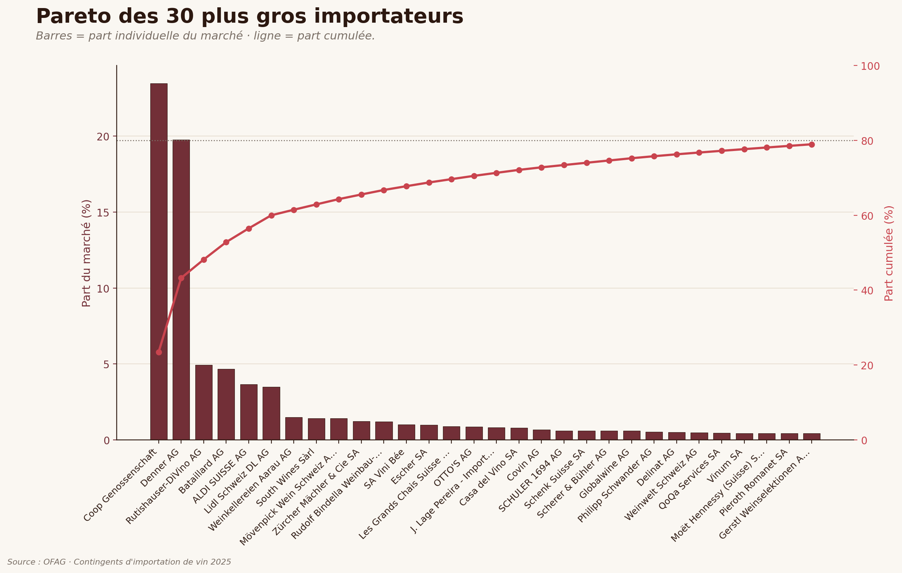](assets/charts/07_pareto.png)<br>**Pareto** : 80 % du marché dès le 16ᵉ acteur | [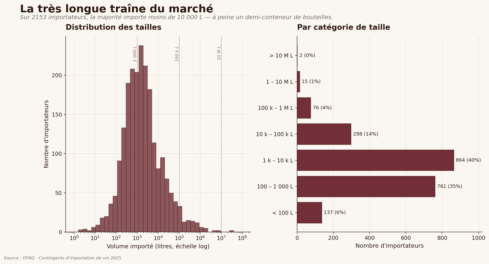](assets/charts/09_distribution.png)<br>**La longue traîne** : 42 % < 1 000 L |

### Groupes et profils

| | |
|---|---|
| [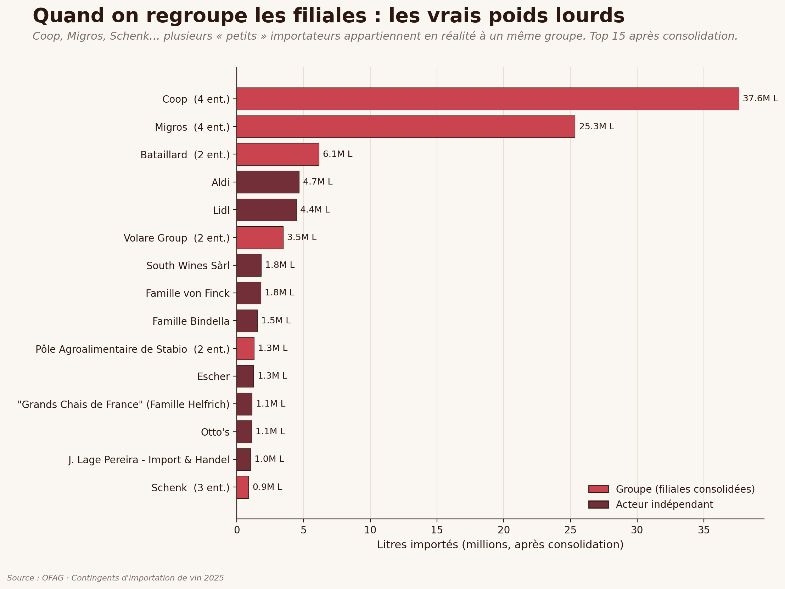](assets/charts/08_consolidation.png)<br>**Filiales consolidées** : Coop → 37,6 M L | [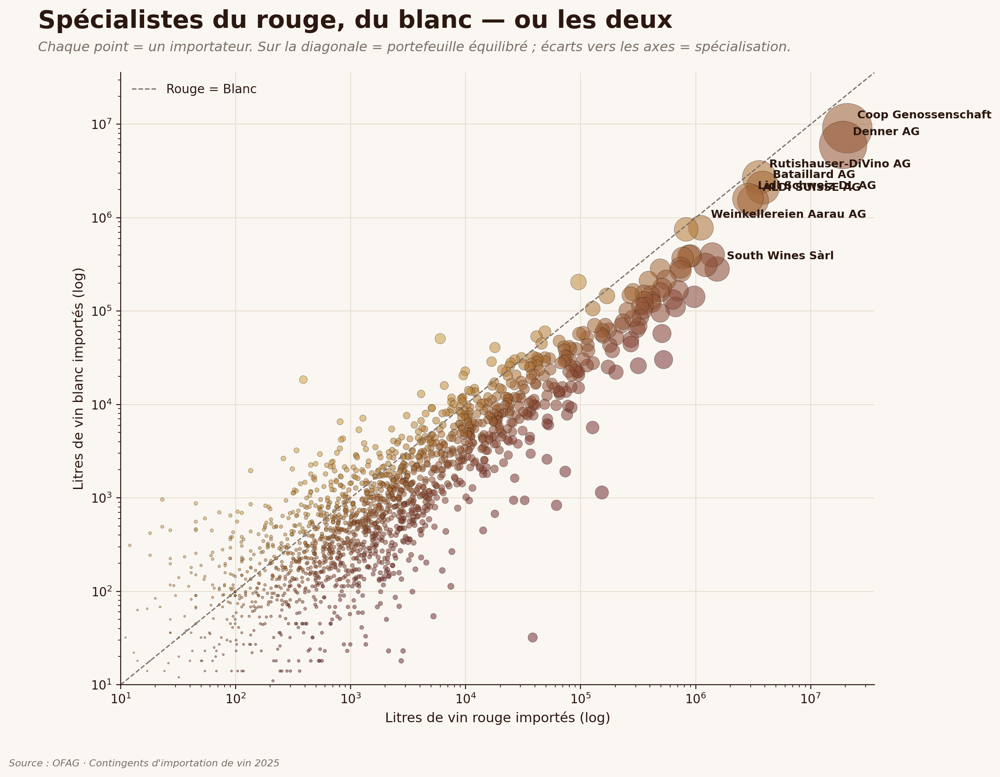](assets/charts/06_rouge_vs_blanc.png)<br>**Rouge vs blanc** : spécialistes et généralistes |

### Géographie et tendances

[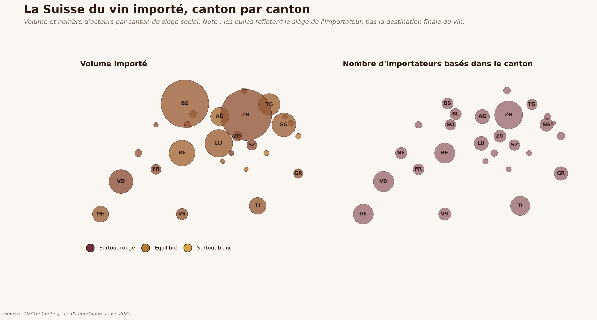](assets/charts/04_carte_cantons.png)

| | |
|---|---|
| [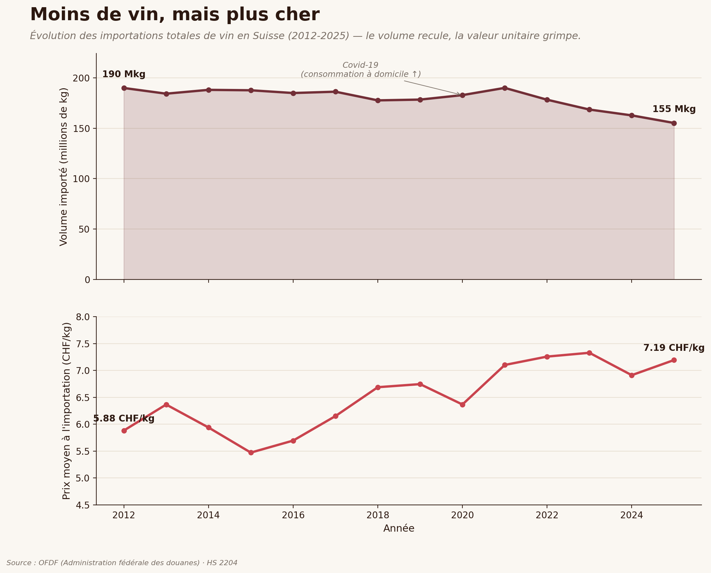](assets/charts/03_historique.png)<br>**Volume & prix moyen** 2012-2025 | [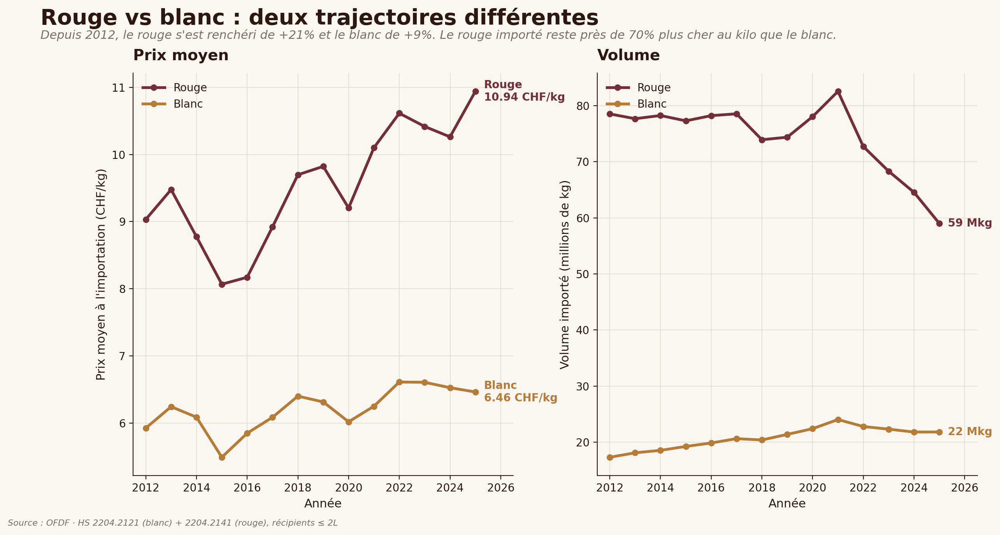](assets/charts/11_segments.png)<br>**Rouge vs blanc** dans le temps |

## 🎛️ Pièces interactives

### Explorateur tabulaire — [`assets/interactive/explorer.html`](assets/interactive/explorer.html)

Fichier autonome ~180 KB, aucune dépendance JS externe.

- 🔍 Recherche instantanée (nom + commune)
- 🏔️ Filtres par canton (27 puces)
- 🔀 Tri multi-colonnes
- 🍷 Toggle rouge / blanc / total
- 📊 Mini-barres rouge/blanc par ligne
- 🌙 **Mode sombre** (toggle en haut à droite, préférence sauvegardée)
- 📌 **Barre de recherche sticky** au scroll
- ⇣ **Export CSV** de la sélection filtrée
- 📋 **Clic sur ligne** → panneau détaillé avec métriques étendues

### Dashboard D3 — [`assets/dashboard/dashboard.html`](assets/dashboard/dashboard.html)

Quatre vues liées qui s'actualisent ensemble :

1. **Carte des cantons** (bulles cliquables) — taille = volume, couleur = mix rouge/blanc
2. **Top 20 importateurs** (barres horizontales) — filtré au canton sélectionné
3. **Scatter rouge vs blanc** (échelle log-log) — révèle les spécialistes
4. **Évolution historique** (aire + ligne) — tooltip sur chaque année

Toggle rouge/blanc/total et mode sombre disponibles. Cliquez sur un canton de la carte → toutes les autres vues se filtrent automatiquement.

> Activez **GitHub Pages** sur `main:/assets` pour publier les deux pièces en ligne.

## 📑 Export xlsx analytique

Un fichier Excel multi-feuilles prêt pour analyse : **`data/processed/wine_imports_analysis.xlsx`** (~254 KB)

| Feuille | Contenu |
|---|---|
| `Importateurs` | 2 153 lignes enrichies (rang, part de marché, share rouge…) |
| `Top 50` | Vue resserrée sur les leaders |
| `Par canton` | 27 cantons agrégés |
| `Par groupe` | Top 50 groupes (filiales consolidées) |
| `Distribution tailles` | 7 tranches de volume + part du marché |
| `Métriques` | Gini, HHI, top-X%, médiane, moyenne — toutes les stats clés |
| `Historique OFDF` | Série 2012-2026 par segment HS |

## 🗂️ Structure du repo

```
Winestat/
├── data/
│   ├── raw/                          ← .xlsx OFAG source
│   └── processed/                    ← CSV nettoyés + xlsx analytique
│       ├── importateurs.csv          ← 2 153 lignes enrichies
│       ├── historique_ofdf.csv       ← série 2012-2026 (OFDF)
│       └── wine_imports_analysis.xlsx ← export multi-feuilles
├── src/
│   ├── clean_data.py                 ← xlsx → CSV
│   ├── theme.py                      ← palette + matplotlib defaults
│   ├── build_interactive.py          ← génère explorer.html
│   ├── build_dashboard.py            ← génère dashboard.html (D3)
│   ├── dashboard_template.html       ← template HTML/D3 (sans données)
│   ├── export_xlsx.py                ← génère le xlsx analytique
│   ├── run_all.py                    ← pipeline complète
│   └── charts/                       ← 11 scripts de graphiques
│       ├── chart_01_top20.py
│       ├── chart_02_lorenz.py
│       ├── chart_03_historique.py
│       ├── chart_04_carte_cantons.py
│       ├── chart_05_treemap.py
│       ├── chart_06_rouge_vs_blanc.py
│       ├── chart_07_pareto.py
│       ├── chart_08_consolidation.py
│       ├── chart_09_distribution.py
│       ├── chart_10_hhi.py
│       └── chart_11_segments.py
├── assets/
│   ├── banner/                       ← header SVG + PNG du repo
│   ├── charts/                       ← PNG (200 dpi) + SVG vectoriel
│   ├── interactive/                  ← explorer.html + JSON
│   └── dashboard/                    ← dashboard.html (D3) + JSON
├── Makefile
├── requirements.txt
└── README.md
```

## ⚡ Reproduire

```bash
git clone https://github.com/your/Winestat.git
cd Winestat
pip install -r requirements.txt

# Tout reconstruire à partir du xlsx :
make all                # = python3 src/run_all.py

# Ou commandes individuelles :
make charts             # uniquement les 11 graphiques
make interactive        # uniquement l'explorateur tabulaire
make dashboard          # uniquement le dashboard D3
make xlsx               # uniquement l'export xlsx

# Servir localement (pour tester explorateur + dashboard) :
make serve              # → http://localhost:8000
```

À dataset constant, les sorties sont déterministes (bit-identiques).

## 🎨 Design

- **Palette** : bordeaux (#722F37), or paille (#D4A547), papier (#FAF7F2), brun encre (#2C1810). Cohérente sur toutes les pièces via `src/theme.py` (Python) et CSS variables (JS).
- **Mode sombre** : bordeaux clair sur fond brun très foncé. Palette CSS variables ailleurs pour basculer en un toggle.
- **Typographie** : *Fraunces* (sérifs variables) pour les titres et chiffres, *Manrope* (sans-serif tabulaire) pour le corps. *DejaVu Sans* dans matplotlib pour portabilité.

## 📚 Sources

| Donnée | Producteur | Format | Période |
|---|---|---|---|
| Contingents d'importation par importateur | OFAG | xlsx | 2025 |
| Importations par section tarifaire (HS 2204) | OFDF | xlsx | 2012-2026 |

## 🤝 Pistes ouvertes

- [ ] Carte choroplèthe avec vrais polygones cantonaux (`geopandas` + shapes swisstopo)
- [ ] Sankey **Canton → Groupe → Type de vin**
- [ ] Bar chart race animée sur la série historique
- [ ] Scrollytelling éditorial (D3 + Scrollama)
- [ ] Géocodage des communes pour cartographie fine

## 📄 License

MIT pour le code et les visualisations dérivées. Les données brutes restent sous la licence OFAG / OFDF.
